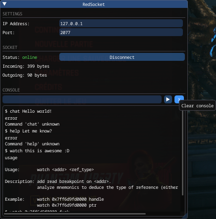

# RedSocket


[](https://www.buymeacoffee.com/lpfreelance)

This plugin allows to connect to a remote TCP server. It is mainly intended for
research purpose. It allows to read and write commands. As an example, it can
be used with a debugger (with its own server script plugin) to send commands 
(e.g. to add breakpoints, watch values, ...). It includes an easy-to-use API for
CET.

> [!IMPORTANT]  
> This implementation is not secure and don't provide any kind of security when
> sending and reading messages. Only use this tool at your own risks, with your
> own TCP server on a local network.

# Getting started

## Compatibility
- Cyberpunk 2077 v2.2
- [RED4ext] v1.26.0+
- [Redscript] 0.5.27+
- [Cyber Engine Tweaks] 1.34.0+

## Installation
1. Install requirements:
- [RED4ext] v1.26.0+
- [Cyber Engine Tweaks] 1.34.0+

2. Extract the [latest archive] into the Cyberpunk 2077 directory.

## Demo



## Usage

This plugin can be used with redscript and CET. It allows any length of commands
to be sent and received.

> [!NOTE]  
> Don't include `\r\n` in a command, it is used internally. If you do, command
> will be ignored.

### Redscript

You need to create a `RedSocket.Socket`:
```swift
import RedSocket.*

let socket = new Socket();

// If ref<Socket> is released, internal network interface will be shutdown.
// It is expected to Disconnect the socket before instance is released.
```

Register listeners for incoming commands (optionally when connection is closed):
```swift
let object: ref<IScriptable>;

socket.RegisterListener(object, n"OnCommand", n"OnDisconnection");
```

> [!NOTE]  
> You must register a listener before calling `Connect`. Any attempts of 
> connection without a listener will be ignored.
> Last argument is optional, declare it if you want to be notified when 
> connection is closed by the remote server.

Connect to a server:
```swift
if !socket.Connect("127.0.0.1", 2077) {
    FTLog(s"Failed to connect on 127.0.0.1:2077");
    return;
}
FTLog(s"Ready to send commands.");
```

Send a message:
```swift
socket.SendCommand("chat Hello world!");
```

Your callback for incoming commands will be executed whenever commands are fully
received.
```swift
// in class of `object` above

public cb func OnCommand(command: String) {
    FTLog(s"Received command: \(command)");
}
```

Your callback for disconnection will be executed whenever the remote server 
closes the connection, or when you close the socket on your end.
```swift
// in class of `object` above

public cb func OnDisconnection() {
    FTLog(s"Connection is now closed.");
}
```

Disconnect from the server like this:
```swift
socket.Disconnect();
FTLog(s"Connection is closed.");
```

### Cyber Engine Tweaks

Import API of this plugin:
```lua
local RedSocket = GetMod("RedSocket")

if RedSocket == nil then
    print("RedSocket is not installed.")
    return
end
```

Create a socket:
```lua
local socket = RedSocket.createSocket()
```

Register listener with callbacks:
```lua
local function OnCommand(command)
    print("Command: " .. command)
end

local function OnDisconnection()
    print("Connection is closed.")
end

socket:RegisterListener(OnCommand, OnDisconnection)
```

Connect to a server:
```lua
if not socket:Connect("127.0.0.1", 2077) then
    print("Failed to connect to server.")
    return
end
print("Ready to send commands.")
```

Send a command:
```lua
socket:SendCommand("chat Hello world!")
```

> [!TIP]  
> You should close sockets based on your usage. In any case, CET plugin keeps
> track of sockets you created. On shutdown event, it will try to disconnect 
> them.


# Development
Contributions are welcome, feel free to fill an issue or a PR.

## Usage
1. Install requirements:
- XMake
- Visual Studio Community 2022+
- [red-cli] v0.4.0+
2. Configure project with:
```shell
xmake -y
```

3. Generate Visual Studio solution:
```shell
xmake project -k vsxmake
```

3. Open .sln and build target `RedSocket` in Debug mode.

It will install scripts and plugin in game's directory, thanks to [red-cli].

## Release
1. Open .sln and build target `RedSocket` in Release mode.

It will prepare outputs and create an archive ready to release. 

<!-- Table of links -->
[RED4ext]: https://github.com/WopsS/RED4ext
[Redscript]: https://github.com/jac3km4/redscript
[Cyber Engine Tweaks]: https://github.com/maximegmd/CyberEngineTweaks
[latest archive]: https://github.com/rayshader/cp2077-red-socket/releases/latest
[red-cli]: https://github.com/rayshader/cp2077-red-cli/releases/latest